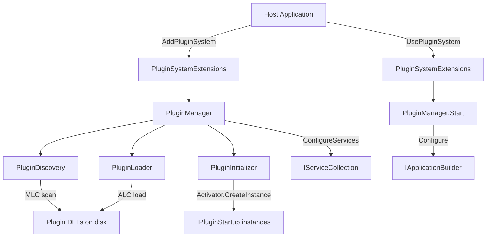

# FluentCMS.Infrastructure.Plugins – Codebase Review

## Architecture Overview



The system follows four sequential phases per plugin:

| Phase | Component | Output |
|---|---|---|
| Discovery | `PluginDiscovery` | `List<string>` assembly paths |
| Loading | `PluginLoader` | `List<Type>` plugin types |
| Initialization | `PluginInitializer` | `List<PluginMetadata>` with live instances |
| Configure / Start | `PluginManager` | Services registered + middleware wired |

---

## Issues Found

### 🔴 Critical / Security

---

#### 1. Arbitrary code execution through unrestricted DLL scanning
**File:** [`PluginDiscovery.Scan()`](FluentCMS.Infrastructure.Plugins/Discovery/PluginDiscovery.cs:42)

The scan path is resolved from `Assembly.GetExecutingAssembly().Location` / `Environment.ProcessPath` and then all `*.dll` files in that directory are enumerated. Any DLL placed in the application's output directory that matches `ScanAssemblyPatterns` (default `FluentCMS.Plugins.*`) will be loaded and executed. There is no:

- signature / hash verification
- allowlist of trusted publishers
- sandbox execution

**Risk:** A supply-chain or filesystem-level attacker can drop a malicious DLL matching the pattern and have it execute with the application's full trust level on next startup.

**Recommendation:**
- Allow operators to configure an explicit, out-of-tree plugin directory rather than defaulting to the host binary directory.
- Optionally add file hash / Authenticode certificate validation before loading.

---

#### 2. `PluginSystemOptions.LoggerFactory` is nullable but used unsafely
**File:** [`PluginSystemOptions.cs:53`](FluentCMS.Infrastructure.Plugins/PluginSystemOptions.cs:53), [`PluginSystemExtensions.cs:27-30`](FluentCMS.Infrastructure.Plugins/PluginSystemExtensions.cs:27)

```csharp
public ILoggerFactory LoggerFactory { get; set; } = default!;  // null-forgiven
```

If a consumer calls `AddPluginSystem` without first setting `options.LoggerFactory`, the `CreateLogger<T>()` extension will throw a `NullReferenceException` at runtime with a completely uninformative stack trace. The `default!` null-forgiveness suppresses the compiler warning.

**Recommendation:**
- Initialise to `NullLoggerFactory.Instance` as the default.
- Or apply `ArgumentNullException.ThrowIfNull` inside `CreateLogger<T>()` with a helpful message.

---

### 🟠 Bugs

---

#### 3. `CancellationTokenSource` (combined) is not always disposed
**File:** [`PluginManager.Configure()`](FluentCMS.Infrastructure.Plugins/PluginManager.cs:36)

```csharp
var combinedCts = CancellationTokenSource.CreateLinkedTokenSource(cancellationToken, timeoutCts.Token);
```

`combinedCts` is disposed in `finally`, but only if the code reaches it. If `timeoutCts` constructor throws (unlikely but possible), `combinedCts` is never created. More importantly: `combinedCts` is correctly in `finally`, but `timeoutCts` is inside the outer `using` while `combinedCts` is NOT wrapped in `using` or its own `try/finally`. If the `finally` block itself throws, the combined token source leaks.

**Recommendation:** Wrap `combinedCts` in `using` as well:

```csharp
using var timeoutCts  = new CancellationTokenSource(_pluginSystemOptions.PluginLoadTimeout);
using var combinedCts = CancellationTokenSource.CreateLinkedTokenSource(cancellationToken, timeoutCts.Token);
```

---

#### 4. `PluginManager.Start()` error logging is misleading when `IgnoreErrors = false`
**File:** [`PluginManager.Start()`](FluentCMS.Infrastructure.Plugins/PluginManager.cs:122)

```csharp
_logger.LogError(ex, "Error during startup of plugin {Plugin}, but continuing due to IgnoreErrors setting", pluginMetadata.Name);
if (_pluginSystemOptions.IgnoreErrors)
```

The log message says "continuing due to IgnoreErrors setting" **before** the `if` check, so if `IgnoreErrors = false` the error is logged with that incorrect message and then immediately re-thrown. The operator sees a misleading log.

**Recommendation:** Move the log inside the `if (IgnoreErrors)` branch, or separate the two messages.

---

#### 5. Duplicate `LogError` / `LogWarning` call in `PluginDiscovery.Scan()`
**File:** [`PluginDiscovery.cs:91-94`](FluentCMS.Infrastructure.Plugins/Discovery/PluginDiscovery.cs:91)

```csharp
_logger.LogError(ex, "Error plugin discovery processing for assembly {Assembly}", assemblyPath);
if (_pluginSystemOptions.IgnoreErrors)
{
    _logger.LogWarning(ex, "Error plugin discovery processing for assembly {Assembly}", assemblyPath);
}
```

The same event is logged twice (once as `Error`, once as `Warning`) when `IgnoreErrors = true`. The `Warning` with exception is likely a leftover from a copy-paste or refactoring.

**Recommendation:** Remove the outer `LogError` when `IgnoreErrors = true`, or restructure:

```csharp
if (_pluginSystemOptions.IgnoreErrors)
    _logger.LogWarning(ex, "...", assemblyPath);
else
    throw new PluginDiscoveryException(...);
```

---

#### 6. `IsNameMatched` pattern matching is over-permissive  
**File:** [`PluginDiscovery.IsNameMatched()`](FluentCMS.Infrastructure.Plugins/Discovery/PluginDiscovery.cs:187-197)

```csharp
if (!scanPatterns.Any(pattern =>
    assemblyFileName.Contains(pattern.Trim('*'), StringComparison.OrdinalIgnoreCase)))
```

- `Trim('*')` converts `"FluentCMS.Plugins.*"` → `"FluentCMS.Plugins."`, then uses `Contains`.  
- A file named `NotFluentCMS.Plugins.Evil.dll` would still match because it **contains** the substring.  
- The full path is passed (e.g., `C:\app\bin\FluentCMS.Plugins.Evil.dll`), so only the filename should be checked.  
- Glob semantics (`*` = any chars) are not actually implemented; only substring match is done.

**Recommendation:** Apply the pattern to `Path.GetFileName(assemblyFileName)` and use proper glob matching (or at least prefix/suffix handling):

```csharp
var fileName = Path.GetFileNameWithoutExtension(assemblyFileName);
var pattern  = ...; // strip leading/trailing *
return fileName.StartsWith(pattern, StringComparison.OrdinalIgnoreCase);
```

---

#### 7. `Start()` counts "failed" plugins incorrectly
**File:** [`PluginManager.Start()`](FluentCMS.Infrastructure.Plugins/PluginManager.cs:135)

```csharp
var failedCount = _pluginMetadataList.Count(p => p.Status != PluginStatus.Started);
```

This counts plugins that were intentionally skipped (e.g., status `ConfigurationFailed`, `InitializeFailed`) as failures **again**, double-reporting them in the startup warning. Only plugins that failed specifically during `Start()` should be counted here.

**Recommendation:**

```csharp
var failedCount = _pluginMetadataList.Count(p => p.Status == PluginStatus.StartFailed);
```

---

#### 8. `PluginLoader.LoadPluginTypes` throws on empty sequence  
**File:** [`PluginLoader.cs:15`](FluentCMS.Infrastructure.Plugins/Loader/PluginLoader.cs:15)

```csharp
NullArgumentException.ThrowIfNullOrEmpty(assemblyFiles);
```

`ThrowIfNullOrEmpty` checks for `null` **or** empty string, but `assemblyFiles` is an `IEnumerable<string>`, not a single string. The overload that runs here is the object overload, which only checks for `null` (per `NullArgumentException`'s logic). If the list itself is empty (no plugins found), this does **not** throw, which is the correct behaviour — but the name `ThrowIfNullOrEmpty` implies an empty collection should throw, which is confusing.

**Recommendation:** Rename to `ThrowIfNull` or use `ArgumentNullException.ThrowIfNull` directly for collection parameters to avoid confusion.

---

### 🟡 Performance

---

#### 9. A new `MetadataLoadContext` (MLC) is created **per assembly**
**File:** [`PluginDiscovery.AssemblyHasPlugin()`](FluentCMS.Infrastructure.Plugins/Discovery/PluginDiscovery.cs:210)

```csharp
using var mlc = new MetadataLoadContext(_resolver);
var asm = mlc.LoadFromAssemblyPath(assemblyPath);
```

`PathAssemblyResolver` holds a snapshot of all probed DLL paths (potentially thousands). Creating and tearing down an MLC for each candidate assembly is expensive — it re-builds internal state each time. For large deployments with many candidate DLLs this can noticeably slow startup.

**Recommendation:** Create a single, shared `MetadataLoadContext` for the entire scan and dispose it once at the end of `Scan()`. The MLC is read-only during scanning, so sharing is safe.

---

#### 10. `AppDomain.CurrentDomain.GetAssemblies()` called in a hot loop
**File:** [`PluginLoader.FindLoaded()`](FluentCMS.Infrastructure.Plugins/Loader/PluginLoader.cs:95)

```csharp
var loadedAsm = AppDomain.CurrentDomain.GetAssemblies()
    .FirstOrDefault(a => AssemblyName.ReferenceMatchesDefinition(a.GetName(), asmName));
```

`GetAssemblies()` copies the entire loaded-assembly list on each call. For N plugin assemblies this is O(N²) over the number of already-loaded assemblies.

**Recommendation:** Snapshot `AppDomain.CurrentDomain.GetAssemblies()` once before the loop in `LoadPluginTypes()` and pass it as a parameter.

---

#### 11. Redundant LINQ `.Count()` calls vs cached value
**File:** [`PluginManager.Configure()`](FluentCMS.Infrastructure.Plugins/PluginManager.cs:70-73), [`Start()`](FluentCMS.Infrastructure.Plugins/PluginManager.cs:134-137)

`_pluginMetadataList.Count(predicate)` is called multiple times in the same method on the same unchanged list. Each call iterates the entire list.

**Recommendation:** Compute counts once and store in a local variable.

---

### 🔵 Design / Maintainability

---

#### 12. `PluginSystemExtensions.AddPluginSystem` manually wires concrete types (DI anti-pattern)
**File:** [`PluginSystemExtensions.cs:12-18`](FluentCMS.Infrastructure.Plugins/PluginSystemExtensions.cs:12)

```csharp
var pluginManager = new PluginManager(
    new PluginDiscovery(...),
    new PluginInitializer(...),
    new PluginLoader(...),
    ...
);
```

All dependencies are manually `new`-ed, bypassing the DI container. This makes unit-testing `AddPluginSystem` impossible without reflection hacks and prevents consumers from substituting their own `IPluginDiscovery`, `IPluginLoader`, or `IPluginInitializer` implementations.

**Recommendation:** Register all internal services into `IServiceCollection` and resolve `IPluginManager` from a temporary `ServiceProvider`, or expose the internal interfaces to allow substitution.

---

#### 13. `PluginSystemOptions.RegisteredALCs` is internal mutable state on a public options class
**File:** [`PluginSystemOptions.cs:51`](FluentCMS.Infrastructure.Plugins/PluginSystemOptions.cs:51)

```csharp
internal List<AssemblyLoadContext> RegisteredALCs { get; } = [];
```

Using the options object as a side-channel to pass ALC references between `PluginLoader` and `PluginManager` is a hidden coupling. The options object should carry only configuration; lifecycle objects should be managed via a dedicated registry or returned from `LoadPluginTypes`.

**Recommendation:** Change `LoadPluginTypes` to return a result type that includes both `List<Type>` and `List<AssemblyLoadContext>`, removing the hidden state from `PluginSystemOptions`.

---

#### 14. `PluginManager.Configure()` passes `CancellationToken.None` from the extension
**File:** [`PluginSystemExtensions.cs:20`](FluentCMS.Infrastructure.Plugins/PluginSystemExtensions.cs:20)

```csharp
pluginManager.Configure(services, configuration, CancellationToken.None);
```

And likewise for `Start()` at line 37. Even though `PluginManager` supports cancellation internally, `AddPluginSystem` discards the caller's token entirely. Hosts that support graceful shutdown tokens (e.g., `IHostApplicationLifetime.ApplicationStopping`) have no way to propagate them.

**Recommendation:** Accept an optional `CancellationToken` parameter in `AddPluginSystem` and `UsePluginSystem`.

---

#### 15. `PluginAttribute` carries no metadata; doc comment states its future purpose
**File:** [`PluginAttribute.cs:10`](FluentCMS.Infrastructure.Plugins.Abstractions/PluginAttribute.cs:10)

The attribute intentionally has no properties. The comment references future metadata like dependencies and load priorities, but `IPluginStartup` already carries priority properties. Having two separate places for priority (attribute vs interface) will create confusion.

**Recommendation:** Decide up front whether priority / dependency info belongs on the attribute or on the interface and document the convention.

---

#### 16. No plugin dependency ordering / dependency graph
**File:** [`PluginManager.Configure()`](FluentCMS.Infrastructure.Plugins/PluginManager.cs:43), [`Start()`](FluentCMS.Infrastructure.Plugins/PluginManager.cs:104)

Plugins are ordered only by numeric priority. There is no way for plugin A to declare "I must run after plugin B". Large plugin ecosystems often need topological ordering based on explicit dependency declarations.

**Recommendation:** Add optional dependency declarations to `PluginAttribute` (e.g., `DependsOn = ["PluginB"]`) and perform topological sort before configuring.

---

#### 17. `PluginMetadata.Instance` holds a live object reference after `UnloadALCsAfterStartup`
**File:** [`PluginManager.Start()`](FluentCMS.Infrastructure.Plugins/PluginManager.cs:140-158)

After the ALC is unloaded, `_pluginMetadataList[n].Instance` still holds a reference to an object whose type was defined in the now-unloaded ALC. Accessing `Instance` after unload will yield `InvalidOperationException` or silent memory-model issues.

**Recommendation:** Set `pluginMetadata.Instance = null` after the ALC is unloaded, and update consumers accordingly.

---

#### 18. `README.md` usage example is outdated / incorrect
**File:** [`README.md:19-25`](README.md:19)

```csharp
var pluginDiscovery = new PluginDiscovery();
var plugins = pluginDiscovery.Scan("path/to/plugin/directory");
```

`PluginDiscovery` is `internal`, takes two constructor parameters (logger + options), and `Scan()` takes no path argument. The example does not reflect the actual public API.

Similarly, [`FluentCMS.Infrastructure.Plugins/README.md:35`](FluentCMS.Infrastructure.Plugins/README.md:35) references `options.PluginDirectory` which does not exist on `PluginSystemOptions`.

**Recommendation:** Update README examples to match actual API.

---

#### 19. `PluginInitializerException` lacks XML doc comments
**File:** [`PluginInitializerException.cs`](FluentCMS.Infrastructure.Plugins/Initializer/PluginInitializerException.cs)

Unlike `PluginDiscoveryException` and `PluginLoaderException`, this class has no `<summary>` XML documentation. Minor but inconsistent.

---

#### 20. No serialization constructor on custom exceptions (CA2229)
**Files:** All three exception classes

None of the custom exceptions implement the serialization constructor `(SerializationInfo, StreamingContext)`. While less critical in .NET 5+, the `[Serializable]` pattern is still relevant for some cross-AppDomain and logging scenarios, and static analysis tools (Roslyn CA2229) flag its absence.

---

#### 21. Test projects are empty shells
**Files:** `FluentCMS.PluginSystem.Tests.Unit/`, `FluentCMS.PluginSystem.Tests.Integration/`, `FluentCMS.PluginSystem.TestPlugins/`

All three test/helper projects exist in the repository but contain zero source files (only `bin/` directories). There is no test coverage for any of the code paths described above.

**Recommendation:** Implement unit tests covering at minimum: `PluginDiscovery.IsNameMatched`, `PluginLoader.FindLoaded`, `PluginInitializer.Initialize` (error path), and `PluginManager` state machine transitions.

---

## Summary Table

| # | Severity | Area | Description |
|---|---|---|---|
| 1 | 🔴 Security | Discovery | No verification of plugin assemblies before loading |
| 2 | 🔴 Security/Bug | Options | `LoggerFactory = default!` causes silent NullReferenceException |
| 3 | 🟠 Bug | Manager | `combinedCts` not always disposed via `using` |
| 4 | 🟠 Bug | Manager | Misleading log message when `IgnoreErrors = false` |
| 5 | 🟠 Bug | Discovery | Double-logging same error (LogError then LogWarning) |
| 6 | 🟠 Bug | Discovery | Pattern match uses `Contains` on full path, not file name |
| 7 | 🟠 Bug | Manager | Failed-count in `Start()` double-counts pre-existing failures |
| 8 | 🟠 Bug | Loader | `ThrowIfNullOrEmpty` semantic mismatch for collection args |
| 9 | 🟡 Performance | Discovery | New `MetadataLoadContext` created per assembly |
| 10 | 🟡 Performance | Loader | `GetAssemblies()` called in per-assembly loop |
| 11 | 🟡 Performance | Manager | Redundant LINQ `.Count()` over same list |
| 12 | 🔵 Design | Extensions | Manual `new` wiring bypasses DI, untestable |
| 13 | 🔵 Design | Options | ALC list is hidden mutable state on options class |
| 14 | 🔵 Design | Extensions | `CancellationToken.None` hard-coded in public API |
| 15 | 🔵 Design | Abstractions | Priority: attribute vs interface ownership unclear |
| 16 | 🔵 Design | Manager | No plugin dependency / ordering graph |
| 17 | 🔵 Design | Manager | Dangling `Instance` ref after ALC unload |
| 18 | 🔵 Docs | ReadME | Usage examples reference non-existent API |
| 19 | 🔵 Docs | Exceptions | `PluginInitializerException` missing XML docs |
| 20 | 🔵 Design | Exceptions | No serialization constructors on custom exceptions |
| 21 | 🔵 Testing | Tests | Test projects are empty |
